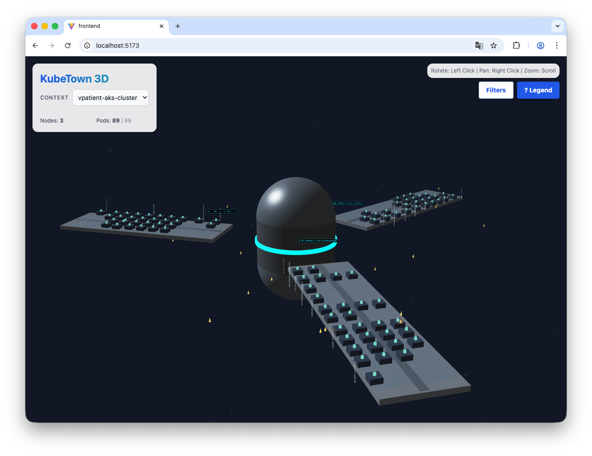

# KubeAstral (Orbital Ops Station)

**KubeAstral** is an immersive 3D visualization tool for Kubernetes clusters, reimagining your infrastructure as a high-fidelity **Orbital Operations Station**. 

Gone are the days of flat YAML lists and tables. KubeAstral renders your nodes, namespaces, deployments, and pods as a cohesive, functional sci-fi space station, allowing for intuitive monitoring and spatial awareness of your cluster's health and topology.


*(Note: Replace with actual screenshot)*

## 🌌 Core Concepts

The system maps Kubernetes concepts to sci-fi architectural elements:

- **Cluster** → **The Station**: A massive engineered structure orbiting in the void.
- **Node** → **Radial Wing**: Large, silver radial arms extending from the central core.
- **Namespace** → **Sector Deck**: Distinct landing zones along the wings.
- **Deployment** → **Module**: Functional cargo blocks housing computational units.
- **Pod** → **Capsule**: Individual glowing units. Their color indicates status (Cyan=Ready, Amber=Pending/Warning, Red=Error).

## ✨ Features

- **Immersive 3D View**: Built with **Three.js** and **React Three Fiber**.
- **Real-Time Topology**: Fetches current cluster state via a local Node.js backend.
- **Visual Health Indicators**: Instant visual feedback on pod health through emissive lighting.
- **Silver & Compact Design**: A sleek, modern aesthetic with efficient grid-packing layout algorithms for high-density clusters.
- **Interactive Labels**: 
    - Floating HUD labels for Deployments (hover-only).
    - Side-mounted holographic labels for Namespaces.
    - Hover details for individual Pods.

## 🛠️ Technology Stack

- **Frontend**: 
  - React 18
  - @react-three/fiber (R3F)
  - @react-three/drei
  - Vite
  - Tailwind CSS
- **Backend**:
  - Node.js
  - Express
  - @kubernetes/client-node

## 🚀 Getting Started

### Prerequisites

- Node.js (v18+)
- A running Kubernetes cluster (Minikube, Kind, Docker Desktop, or remote)
- `kubectl` configured locally

### Installation

1. **Clone the repository**
   ```bash
   git clone https://github.com/yourusername/kubeastral.git
   cd kubeastral
   ```

2. **Setup Backend**
   The backend proxies requests to your local Kubernetes config.
   ```bash
   cd backend
   npm install
   # Run the server
   npm run dev
   ```
   *Server runs on http://localhost:3001*

3. **Setup Frontend**
   Open a new terminal for the visualization client.
   ```bash
   cd frontend
   npm install
   # Start the React app
   npm run dev
   ```
   *Open your browser to the local Vite URL (e.g., http://localhost:5173)*

## 🎮 Controls

- **Rotate**: Left Click + Drag
- **Pan**: Right Click + Drag
- **Zoom**: Scroll Wheel
- **Inspect**: Hover over modules and capsules for details

##  License

MIT
